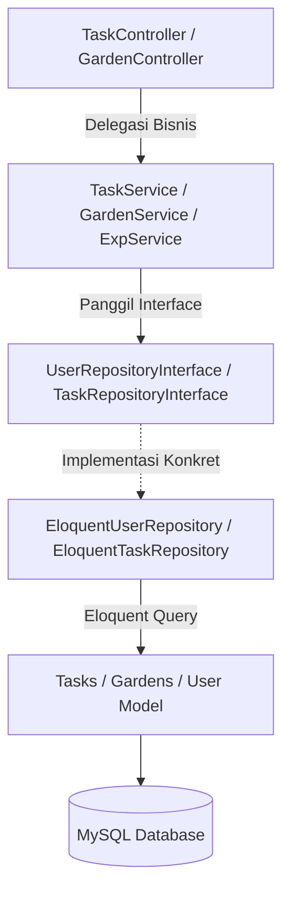

# Garden of Habits (REST API Backend)

RESTful API untuk aplikasi pelacak tugas dan kebiasaan berbasis gamifikasi kebun virtual (*virtual garden*), dilengkapi dengan sistem peningkatan level progresif, streak produktivitas, serta timer Pomodoro.

---

## Pola Arsitektur (Service-Repository Pattern dengan Interface)

Proyek ini menerapkan **Service-Repository Pattern** menggunakan **Interfaces/Contracts** untuk memisahkan secara ketat logika bisnis dari detail akses data. 



*   **Repository Contracts (Interfaces)**: Ditempatkan di [app/Repositories/Contracts/](app/Repositories/Contracts/), berisi definisi kontrak fungsi database untuk `UserRepositoryInterface`, `TaskRepositoryInterface`, `GardenRepositoryInterface`, `PomodoroRepositoryInterface`, dan `RefreshTokenRepositoryInterface`.
*   **Eloquent Repositories (Concrete Class)**: Ditempatkan di [app/Repositories/Eloquent/](app/Repositories/Eloquent/), berisi query Eloquent asli yang mengimplementasikan kontrak interface terkait.
*   **Service Layer**: Ditempatkan di [app/Services/](app/Services/), mengelola logika bisnis inti (gamifikasi, level, streak, decay) secara modular.
*   **Dependency Injection & Binding**: Diikat secara global melalui [app/Providers/RepositoryServiceProvider.php](app/Providers/RepositoryServiceProvider.php) dan didaftarkan pada [bootstrap/providers.php](bootstrap/providers.php).

---

## Fitur Backend Utama

### 1. Sistem Gamifikasi Dinamis
*   **XP & Leveling System**:
    *   [ExpService.php](app/Services/Gamification/ExpService.php): Mengkalkulasi penambahan XP berdasarkan tingkat kesulitan tugas (`easy`, `medium`, `hard`) dan mengalikannya dengan *streak multiplier*.
    *   [LevelService.php](app/Services/Gamification/LevelService.php): Logika kenaikan level progresif dengan kalkulasi otomatis selisih XP menggunakan *while-loop* dinamis saat melompati beberapa level sekaligus.
*   **Virtual Garden (Decay Logic)**: 
    *   [GardenService.php](app/Services/Gamification/GardenService.php): Kesehatan tanaman (HP) kebun virtual pengguna akan berkurang otomatis sebanyak 10 HP per hari ketidakaktifan produktif.
    *   Fase visual tanaman berkembang secara otomatis dari `seed` -> `sprout` -> `tree` seiring dengan meningkatnya level akun pengguna.
*   **Streak Multiplier**:
    *   [StreakService.php](app/Services/Gamification/StreakService.php): Melacak streak produktivitas berturut-turut. Streak akan hangus (kembali ke 0) jika melewati masa kedaluwarsa 60 menit setelah penyelesaian tugas terakhir. Peningkatan streak memberikan pengali XP (hingga 2.0x).

### 2. Pomodoro Timer
*   [PomodoroService.php](app/Services/PomodoroSession/PomodoroService.php): Mengelola dan memvalidasi sesi aktif Pomodoro. Transaksi dianggap sukses dan berhak memicu streak apabila pengguna fokus minimal selama 25 menit (mencegah manipulasi waktu di sisi frontend).

### 3. Keamanan Sesi Kustom
*   Otentikasi token akses menggunakan **Laravel Sanctum**.
*   Menyediakan sistem rotasi kustom lewat tabel `refresh_tokens` untuk meminimalisasi risiko penyalahgunaan token akses yang kedaluwarsa via [AuthService.php](app/Services/Auth/AuthService.php).

---

## Struktur Direktori Penting

*   **Rute API**: `routes/api.php`
*   **Logika Bisnis (Services)**: `app/Services/`
*   **Kontrak Repositori (Interfaces)**: `app/Repositories/Contracts/`
*   **Implementasi Database (Eloquent)**: `app/Repositories/Eloquent/`
*   **Model Database**: `app/Models/`
*   **Request Validation**: `app/Http/Requests/`

---

## Langkah Instalasi Lokal

### Prasyarat
*   PHP >= 8.2
*   Composer
*   MySQL atau MariaDB

### Cara Menjalankan
1.  Clone repositori ini dan masuk ke foldernya.
2.  Instal seluruh dependensi:
    ```bash
    composer install
    ```
3.  Salin konfigurasi environment:
    ```bash
    cp .env.example .env
    ```
4.  Konfigurasikan database pada berkas `.env` Anda:
    ```env
    DB_CONNECTION=mysql
    DB_HOST=127.0.0.1
    DB_PORT=3306
    DB_DATABASE=garden_of_habits
    DB_USERNAME=root
    DB_PASSWORD=
    ```
5.  Generate application key:
    ```bash
    php artisan key:generate
    ```
6.  Jalankan migrasi database:
    ```bash
    php artisan migrate
    ```
7.  Nyalakan server lokal:
    ```bash
    php artisan serve
    ```
    API akan berjalan pada `http://127.0.0.1:8000`.
